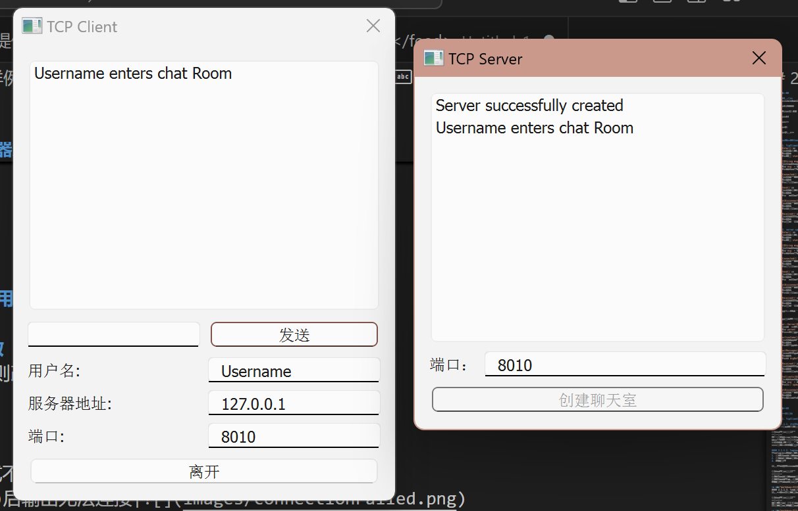

# 1. 系统实现

## 1.1. 运行环境
计算机环境：windows11

处理器：i913900HX

内存（RAM）：32.0GB

系统类型：x64

编程语言：c++

程序框架：Qt

实现语言：Qt和c++

## 1.2. 关键函数说明

### 1.2.1. TcpClient.cpp(客户端后台程序)
1. `slotEnter()`：
   - 功能：处理用户进入或离开聊天室的逻辑。
   - 参数：无。
   - 描述：如果`status`为`false`（表示当前未连接），则尝试连接到服务器；如果`status`为`true`（表示已连接），则发送离开消息并断开连接。在连接前会检查服务器IP地址和用户名是否有效。

2. `Send(QString msg)`：
   - 功能：发送消息到服务器。
   - 参数：`msg` - 要发送的消息字符串。
   - 描述：将消息字符串转换为字节流，并使用`QTcpSocket`发送。

3. `slotConnected()`：
   - 功能：处理客户端成功连接到服务器后的操作。
   - 参数：无。
   - 描述：启用发送按钮，更改“进入”按钮文本为“离开”，并向聊天室发送进入消息。

4. `slotSend()`：
   - 功能：处理用户发送消息的操作。
   - 参数：无。
   - 描述：检查输入框是否有文本，如果有，则构造格式化的消息并发送，然后清空输入框。

5. `clientDisconnected()`：
   - 功能：处理客户端断开连接后的操作。
   - 参数：无。
   - 描述：禁用发送按钮，更改“离开”按钮文本为“进入聊天室”。

6. `dataReceived()`：
   - 功能：处理接收到的数据。
   - 参数：无。
   - 描述：读取所有可用数据，将其添加到缓冲区`bigBuffer`中。然后使用`QDataStream`解析消息长度和消息内容，并将消息添加到聊天内容列表中。最后，更新`bigBuffer`以去除已处理的消息。

### 1.2.2. server.cpp(服务器后台程序)
1. `slotEnter()`：
   - 功能：处理用户进入或离开聊天室的逻辑。
   - 参数：无。
   - 描述：如果`status`为`false`（表示当前未连接），则尝试连接到服务器；如果`status`为`true`（表示已连接），则发送离开消息并断开连接。在连接前会检查服务器IP地址和用户名是否有效。

2. `Send(QString msg)`：
   - 功能：发送消息到服务器。
   - 参数：`msg` - 要发送的消息字符串。
   - 描述：将消息字符串转换为字节流，并使用`QTcpSocket`发送。

3. `slotConnected()`：
   - 功能：处理客户端成功连接到服务器后的操作。
   - 参数：无。
   - 描述：启用发送按钮，更改“进入”按钮文本为“离开”，并向聊天室发送进入消息。

4. `slotSend()`：
   - 功能：处理用户发送消息的操作。
   - 参数：无。
   - 描述：检查输入框是否有文本，如果有，则构造格式化的消息并发送，然后清空输入框。

5. `clientDisconnected()`：
   - 功能：处理客户端断开连接后的操作。
   - 参数：无。
   - 描述：禁用发送按钮，更改“离开”按钮文本为“进入聊天室”。

6. `dataReceived()`：
   - 功能：处理接收到的数据。
   - 参数：无。
   - 描述：读取所有可用数据，将其添加到缓冲区`bigBuffer`中。然后使用`QDataStream`解析消息长度和消息内容，并将消息添加到聊天内容列表中。最后，更新`bigBuffer`以去除已处理的消息。

这些函数共同实现了一个基于Qt框架的TCP客户端的基本聊天功能，包括连接、发送消息、接收消息和断开连接。

以下是您提供的服务器端代码中关键函数的说明：

1. `Server::Server(QObject* parent, int port)`：
   - 功能：构造函数，初始化服务器。
   - 参数：`parent` - 父对象指针；`port` - 服务器监听的端口号。
   - 描述：尝试在指定端口上监听传入连接。如果监听失败，显示错误消息。并连接`newConnection()`信号到`connectionCame()`槽函数。

2. `connectionCame()`：
   - 功能：处理新的客户端连接。
   - 参数：无。
   - 描述：接受新的连接，并将其添加到客户端套接字列表中。然后连接`readyRead()`和`disconnected()`信号到相应的槽函数。

3. `extractMessages()`：
   - 功能：从接收到的数据中提取消息。
   - 参数：无。
   - 描述：从`bigBuffer`中提取消息长度和消息内容，并将消息分发给所有客户端。此函数处理消息的解析和分发。

4. `dataReceived()`：
   - 功能：处理接收到的数据。
   - 参数：无。
   - 描述：获取发送者的`QTcpSocket`对象，读取所有可用数据，并将其添加到`bigBuffer`中。然后调用`extractMessages()`来处理消息。

5. `updateClients(QString msg)`：
   - 功能：将消息更新到所有客户端。
   - 参数：`msg` - 要发送的消息字符串。
   - 描述：发出`updateServer`信号，并遍历客户端套接字列表，将消息发送给每个客户端。

6. `clientDisconnected()`：
   - 功能：处理客户端断开连接。
   - 参数：无。
   - 描述：将发送者的`QTcpSocket`对象从客户端列表中移除，并断开连接。

# 2. 系统测试

## 2.1. 测试用例

### 2.1.1. TcpClient.cpp（用户模块）

#### 2.1.1.1. slotEnter函数
连接服务器模块，如果连接成功则改变客户端的状态，连接不成功则报错。

用例描述|结果|截图
--|--|--
服务器地址非法|直接报错，格式不对|
无法访问服务器|在timeout(1s)后输出无法连接|
连接成功|服务器和客户端聊天框都输出进入成功的信息|
其他用户连接成功|聊天室内的用户会收到提示|

#### 2.1.1.2. send函数
客户端发送消息给服务器，服务器转发消息给其他客户端

用例描述|结果|截图
--|--|--
Username发送消息|服务器转发给username2|
发送中文消息|服务器转发|

#### 2.1.1.3. clientDisconnected函数

用例描述|结果|截图
--|--|--
Username2用户离开|服务器转发给Username |
用户直接关闭窗口|服务器收到并转发退出的消息|
服务器直接关闭窗口|客户端改变状态到未连接|

## 2.2. 结果分析
服务器能够正确处理用户连接和通信的请求，服务器和客户端也可以正确处理直接断开的异常情况。
