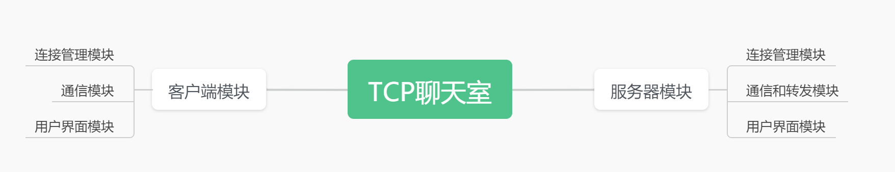
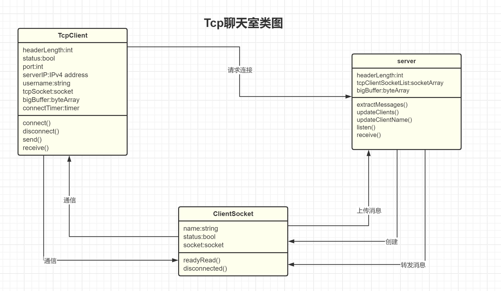

# 1.系统结构
## 1.2. 客户端通信模块

### 1.2.1. 模块概述

网络通信模块负责与服务器建立TCP连接，发送和接收数据，处理用户输入和显示聊天内容。该模块是客户端的核心部分，确保用户能够顺利加入聊天室并进行实时通信。

### 1.2.2. 模块结构

#### 1.2.2.1. UI组件

1. **QListWidget**: 显示聊天内容，用户可以查看历史消息。
2. **QLineEdit 和 QPushButton**: 用户输入消息并发送。
3. **标签和编辑框**: 输入用户名、服务器IP和端口。
4. **进入聊天室按钮**: 切换进入或离开聊天室状态。

#### 1.2.2.2. 后台处理函数

1. **构造函数**: 初始化UI和连接信号槽。
2. **slotEnter**: 处理进入或离开聊天室的逻辑。
3. **slotSend**: 发送用户输入的消息。
4. **clientDisconnected**: 处理与服务器断开连接的情况。
5. **dataReceived**: 处理从服务器接收的数据。
6. **Send**: 发送数据的辅助函数。
7. **slotTimeout**: 连接超时处理。

### 1.2.3. 功能描述

#### 1.2.3.1. 构造函数

- 初始化UI组件和布局。
- 设置窗口标题和初始状态。
- 连接信号槽，确保用户交互事件能够正确触发相应处理函数。

#### 1.2.3.2. slotEnter

- 检查当前状态，若未连接，则尝试连接服务器。
- 验证用户输入的服务器IP和用户名。
- 建立TCP连接，并启动连接超时定时器。
- 若已连接，则断开与服务器的连接并更新界面状态。

#### 1.2.3.3. slotSend

- 获取用户输入的消息，拼接用户名和消息内容。
- 调用Send函数将消息发送至服务器。
- 清空输入框，准备下一条消息。

#### 1.2.3.4. clientDisconnected

- 处理与服务器断开连接的情况。
- 禁用发送按钮，更新界面状态为未连接。

#### 1.2.3.5. dataReceived

- 读取服务器发送的数据，解析消息长度和内容。
- 将消息显示在QListWidget中。
- 处理数据流，确保不丢失数据。

#### 1.2.3.6. Send

- 将消息转换为字节数组，使用QDataStream序列化。
- 通过QTcpSocket发送数据至服务器。

#### 1.2.3.7. slotTimeout

- 处理连接超时情况，显示错误信息。
- 停止定时器，关闭连接尝试。

### 1.2.4. 模块交互

- **与服务器模块交互**: 通过TCP协议进行数据传输，发送和接收消息。
- **与用户界面模块交互**: 获取用户输入，显示聊天内容，响应用户操作。

通过以上结构和功能描述，网络通信模块确保客户端能够稳定地与服务器进行通信，提供流畅的聊天体验。


## 1.3. 服务器模块

服务器模块是后端的核心部分，负责处理与多个客户端的连接和通信。其主要功能包括：

1. **监听连接请求**：服务器监听指定端口，接受新的客户端连接。
2. **管理客户端连接**：维护连接客户端的列表，处理客户端连接和断开事件。
3. **消息处理与广播**：接收客户端消息，处理消息内容，并将消息广播给所有连接的客户端。


### 1.3.1. 类概述

`Server` 类继承自 `QTcpServer`，负责管理多个客户端的连接和通信。它处理新连接、接收数据、广播消息和管理客户端状态。

### 1.3.2. 构造函数

```cpp
Server::Server(QObject* parent, int port) : QTcpServer(parent)
```

- **参数**:
  - `parent`: 父对象，用于QObject的继承机制。
  - `port`: 服务器监听的端口号。
- **功能**:
  - 初始化服务器，使其监听指定端口。
  - 如果监听失败，弹出错误提示框。

### 1.3.3. 成员函数

#### 1.3.3.1. connectionCame()

```cpp
void Server::connectionCame()
```

- **功能**:
  - 处理新的客户端连接。
  - 创建 `ClientSocket` 对象并将其添加到连接列表。
  - 连接 `readyRead` 和 `disconnected` 信号到相应槽函数。

#### 1.3.3.2. extractMessages()

```cpp
void Server::extractMessages(ClientSocket* recvSocket)
```

- **参数**:
  - `recvSocket`: 接收消息的客户端套接字。
- **功能**:
  - 从缓冲区中提取消息，根据客户端状态处理消息内容。
  - 如果客户端已认证，广播消息；否则，更新客户端名称。

#### 1.3.3.3. dataReceived()

```cpp
void Server::dataReceived()
```

- **功能**:
  - 读取客户端发送的数据并将其添加到缓冲区。
  - 调用 `extractMessages()` 处理接收到的数据。

#### 1.3.3.4. updateClients()

```cpp
void Server::updateClients(QString msg)
```

- **参数**:
  - `msg`: 要广播的消息。
- **功能**:
  - 将消息广播给所有连接的客户端。

#### 1.3.3.5. updateClientName()

```cpp
void Server::updateClientName(QString name, ClientSocket* clientSocket)
```

- **参数**:
  - `name`: 客户端名称。
  - `clientSocket`: 客户端套接字。
- **功能**:
  - 更新客户端名称，并发送进入聊天室的消息给所有客户端。

#### 1.3.3.6. clientDisconnected()

```cpp
void Server::clientDisconnected()
```

- **功能**:
  - 处理客户端断开连接事件。
  - 发送离开聊天室的消息给所有客户端。

### 1.3.4. 信号与槽连接

- **新连接信号**:
  - `newConnection() -> connectionCame()`
- **客户端准备读取数据**:
  - `ClientSocket::readyRead() -> dataReceived()`
- **客户端断开连接**:
  - `ClientSocket::disconnected() -> clientDisconnected()`

### 1.3.5. 数据成员

- `tcpClientSocketList`: 存储所有连接的 `ClientSocket` 对象的列表。
- `bigBuffer`: 用于存储接收到的数据缓冲区。
- `headerLength`: 消息头长度，定义消息长度字段的大小。

通过以上结构和功能描述，服务器模块确保能够稳定地管理多个客户端连接，处理消息并进行广播，提供流畅的聊天室体验。

## 1.4 系统结构图

## 1.5 系统类图

## 1.6 关键数据结构定义
### 1.6.1 客户端数据结构
```cpp
	const int headerLength = 4;
        //tcp消息中头字段长度，用来标识消息的长度
	bool status;
        //客户端连接状态
	int port;
        //服务器端口
	QHostAddress* serverIP;
        //服务器ip
	QString userName;
        //聊天室中显示的昵称
	QTcpSocket* tcpSocket;
        //连接成功后与服务器通信的套接字
	QByteArray bigBuffer;
        //接受tcp消息的缓冲区，先把消息写入其中，再从中解析消息
	QTimer* connectTimer;
        //处理连接服务器的超时
```
### 1.6.2 服务器监听数据结构
```cpp
	const qsizetype headerLength = 4;
        //同上，消息首部长度
	QVector<ClientSocket*> tcpClientSocketList;
        //保存所有连接到聊天室的客户端套接字，用来存储客户端昵称和转发消息
	QByteArray bigBuffer;
        //tcp消息缓冲区，用于解析消息
```
### 1.6.3 服务器监听套接字数据结构
```cpp
	QTcpSocket* socket;
	int status;
	QString name;
```
## 1.7 关键算法设计
主要难点在于解析tcp缓冲区并且处理tcp粘包问题。这里以服务器的解析算法为例，客户端的解析算法是相同的。
```cpp
void Server::extractMessages(ClientSocket* recvSocket) {
	qint32 messageLength;
	while (bigBuffer.size()) {
		QDataStream recv_data(&bigBuffer, QIODevice::ReadOnly);
		recv_data.setVersion(QDataStream::Qt_6_8);
		if (bigBuffer.size() < headerLength)
			break;
		recv_data >> messageLength;
            //首先从buffer中读出消息长度
		if (bigBuffer.size() < headerLength + messageLength)
			break;
            //再等待buffer中有足够的消息长度
		QByteArray msg;
		for (int i = 0; i < messageLength; i++) {
			char c;
			recv_data >> c;
			msg.append(c);
		}
            //按char读入指定长度的内容
		QString msgStr = QString::fromUtf8(msg);
            //转换成QString准备输出
		if (recvSocket->status == 1) {
			updateClients(msgStr);
                //正常读入消息
		} else {
			updateClientName(msg, recvSocket);
                //对于第一条消息，设置为用户的昵称
		}
		bigBuffer = bigBuffer.right(bigBuffer.length() - messageLength - headerLength);
            //读完消息以后从缓冲区中减掉对应的长度
	}

}

```