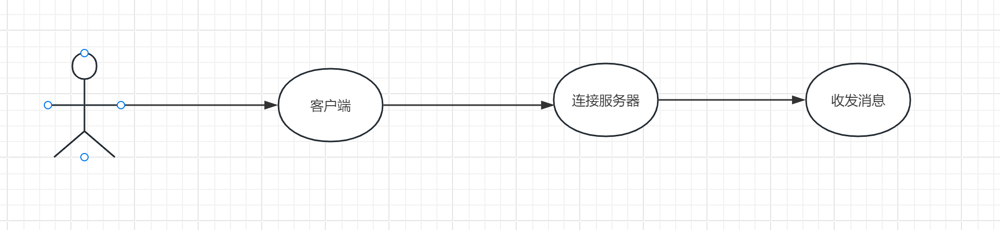
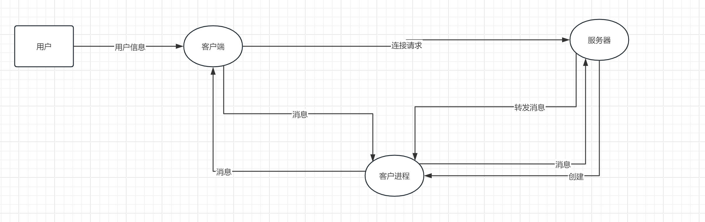
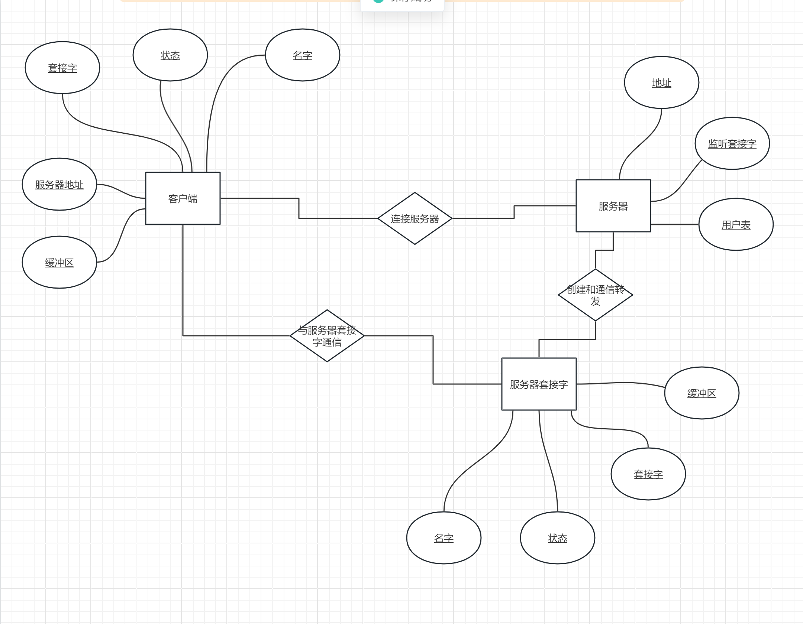

## 产品描述
一个简单的tcp聊天室服务器-客户端程序
## 产品功能
实现实时的聊天室服务。

## 系统用例

## 系统数据流图
系统运行数据流图如下

## 系统ER图
有上述描述可以得到系统的ER图如下

## 系统功能描述
基于qt开发简单的客户端应用程序

### 连接服务器
用户输入服务器的ip地址，并连接服务器。如果连接成功，发送按钮由禁用转为启用，连接失败则提示超时。

### 发送消息
用户向服务器发送消息，服务器将消息转发给所有连接的用户

### 接收消息
用户接受服务器转发的其他用户消息

